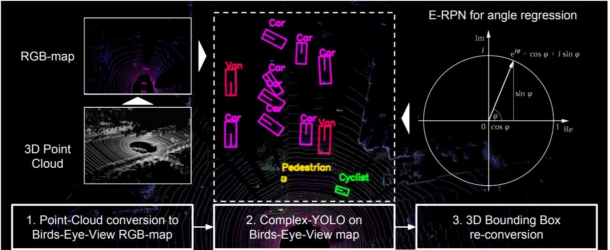
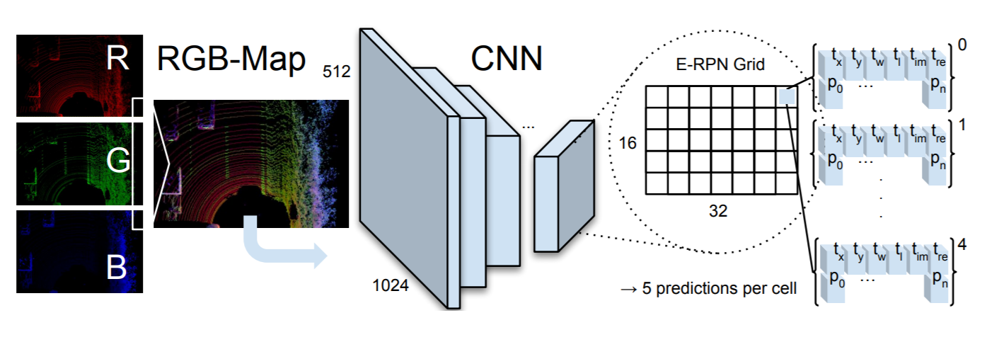
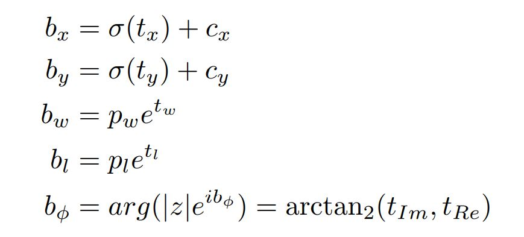
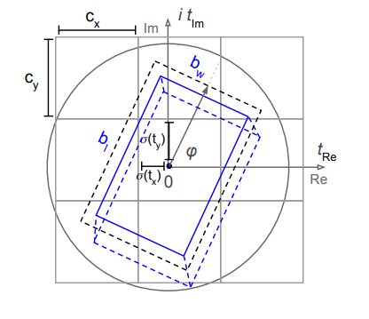

# Purpose

The purpose of the repository is to gain an understanding of Complex-YOLO and try it out for myself for the purpose of my Final Year Project (FYP). The code repository was taken from [Deepak Ghimire](https://github.com/ghimiredhikura/Complex-YOLOv3). I have investigated the details of the algorithms and reported it here (and in my FYP). Some extra test was also done to gain more insights. Visualisation of Complex-YOLO inference on KITTI Dataset (12 images stitch together):

# Complex-YOLO (Details)

The Complex-YOLO algorithm only uses Lidar point cloud data to make 3D Object Detection predictions by converting the point cloud data into a 2D bird-eye view format so that a standard 2D Object Detection algorithm can be used. The key idea of Complex-YOLO is that by configuring point cloud data into a format usable for 2D bounding box regression, we can leverage very well researched and mature 2D Object Detection Algorithms such as YOLO. The benefit of using YOLO is that it is real-time and efficient.

The main challenge for Complex-YOLO is that if only 2D bounding box regression is used, there is not enough information to estimate 3D bounding boxes as we are lacking the information regarding the pose of the object. Thus, the Euler Region Proposal Network (E-RPN) is proposed to estimate the pose of the object by adding an imaginary and a real fraction to the regression network. 

(Missing Research) - The angle regression will then have a closed mathematical space without singularities allows robust angle predictions.

Figure below shows the summary of steps taken by the Complex-YOLO algorithm.

In the first step, Complex-YOLO converts the point cloud lidar data into a bird-eye view RGB map by encoding the RGB-map with height,intensity and density. This was done by projecting and discretising 3D point cloud data into a 2D grid of size 1024 x 512. The point cloud data used are constrained within an area of 80m x 40m. Thus, the resolution of the grid was about 8cm to get the desirable grid size. 

Each grid cell is encoded for its height, intensity, and density based on the number of points contained in it. The encoding is done by taking the maximum height of the point cloud, the maximum intensity and the normalised density of all points in the grid cell.

% In github, explain through lines

% refer to kitti_bev_utils.py, line26 - makeBVFeature  and config.py to see the area configuration.  kitti_yolo_dataset.py is used to preprocess the data which is called in the main (train.py) -line82 __getitem__ shows  is how the data from kitti is processed before training (it calls makeBVfeature)

In the next step, Complex-YOLO can then use YOLOv2 to predict 2D bounding boxes on the bird-eye view RGB-map that was produced. It is worth noting that YOLOv2 can be interchangeable with any 2D detectors. 

The figure above is a simple illustration of the Complex-YOLO pipeline, the final grid comes up to a size of 16 x 32 after running the YOLO network on the RGB-map. On each grid cell, YOLO makes 5 bounding box predictions per cell. 

Each bounding box prediction consist of 15 regression parameters. One of the parameter is the objectness probability, 3 parameters are class probabilities assuming we only want to detect 3 classes (Cars, Pedestrians,Cyclists).

4 parameters is used to find the dimension of bounding box which are $t_{x}$ , $t_{y}$ , $t_{w}$ and ($t_{l}$). 2 parameters are the real and imaginary parts of the angle of bounding box ($t_{Im}$, $t_{Re}$).  The last 5 parameters are $\alpha$,$c_{x}$,$c_{y}$,$p_{w}$,$p_{l}$ which are necessary for the E-RPN approach. E-RPN calculates the proper orientation angle ($b_{\phi}$) by modifying the Grid-RPN equation by adding a complex angle $\text{arg}(|z|e^{ib_{\sigma}})$:

$b_{l}$ is the length of the box, $b_{w}$ is the width of the box, $b_{x}$ is the x-coordinate of the box and $b_{y}$ is the y-coordinate of the box. 

Missing: How does RPN work? -missing explanation on how does complex angle avoid singularity +  why exponential

Figure below illustrates the regression parameters of the E-RPN approach. 

After all of the parameters are calculated, the 2D Bounding Box prediction on the RGB-map is converted to 3D by using a predefined height based on each object class. This is one of the key weakness of the algorithm, it uses a pre-defined object height which makes the results very poor when you increase the IoU metric as objects of the same category usually differ in height.

# Extra Test/Insight

Point Cloud data can be very sparse + Complex-YOLO takes everything from the bird eye view and just push to the ground. Thus, we can guess that it will do very poorly with objects such as Pedestrian and Cyclist once we increase the IoU:

mAP (0.75 IoU):

| Model/Class             | Car     | Pedestrian | Cyclist | Average |
| ----------------------- |:--------|:-----------|:--------|:--------|
| Complex-YOLO-v3         | 91.66   |    9.0     |  24.37  |  41.7   |

Besides that, I added a COCO style object detection metric as it is a good indication of performance:

COCO (IOU [.50: .05: .95]):

| Model/Class             | Car     | Pedestrian | Cyclist | Average |
| ----------------------- |:--------|:-----------|:--------|:--------|
| Complex-YOLO-v3         |70.92    | 31.67      | 42.48   | 48.35   |

I plan to get a few different object detection algorithms and test the difference using the COCO Metric. I believe that algorithms that is more robust, the performance will not degrade badly when a more stringent metric is used.
